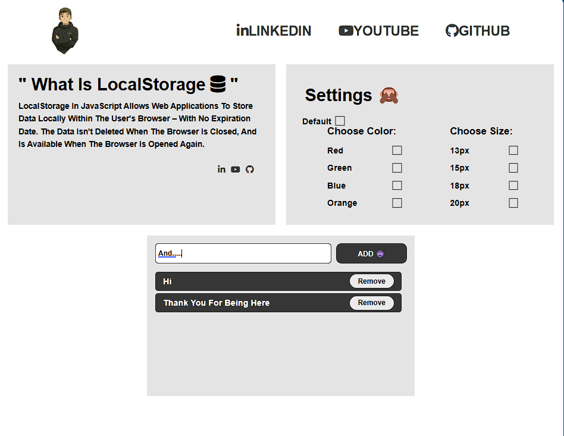

# 📦 localStorage Mini Projects

This project is a simple and clean demonstration of how to use **localStorage** in web development to **save user settings and tasks** permanently (even after refreshing the page).

---

## What I have done:

- ✅ Built a complete **HTML page** with **Header**, **Main Content**, **Settings**, and **Todo List** sections.
- ✅ Designed a **responsive layout** using **CSS Flexbox**.
- ✅ Used **FontAwesome Icons** for better UI experience.
- ✅ Created a **Settings Panel** where users can:
  - Choose a **font color** for the content text.
  - Choose a **font size** for the content text.
  - Reset settings back to **Default**.
- ✅ Created a **Todo List App** where users can:
  - **Add** new tasks.
  - **Delete** tasks.
  - **Save** all tasks automatically to **localStorage**.
- ✅ Used **JavaScript ES6+** (arrow functions, template literals, etc.)
- ✅ Applied **LocalStorage** to **persist** both **settings** and **todos** even after page reload.

---

## Technologies used:

- HTML5
- CSS3
- JavaScript (Vanilla)
- LocalStorage API
- FontAwesome

---

##  What I plan to improve next:

- **Add theme switching** (Dark mode / Light mode).
- **Add clear all todos button**.
- **Mark tasks as completed** with a "Done" button.
- **Save due dates** for tasks.
- **Make it mobile responsive** (better design on phones).
- **Validate input** (don't allow empty tasks).
- **Edit tasks** without deleting them.
- **Use OOP (Classes)** to better organize the JavaScript.
- Maybe even build a **small backend (Node.js)** in the future to sync the todos online.

---

## Preview Screenshot:

---

## What I learned:

- How to use `localStorage.getItem()`, `setItem()`, `removeItem()`, and `clear()`.
- How to store and retrieve **arrays/objects** in localStorage using `JSON.stringify()` and `JSON.parse()`.
- How to dynamically **create and remove elements** from the DOM.
- How to **persist UI state** (color, size, tasks) after reloading the page.
- Better practice with **Event Listeners**, **forEach**, **filter()**, and working with **IDs**.

---

## Final Words:

This project is a **solid foundation** for mastering **localStorage**.  
Next steps will be about making it **even smarter**, **more organized**, and **better designed**.  
One day it can even become a real mini app you can publish online!
